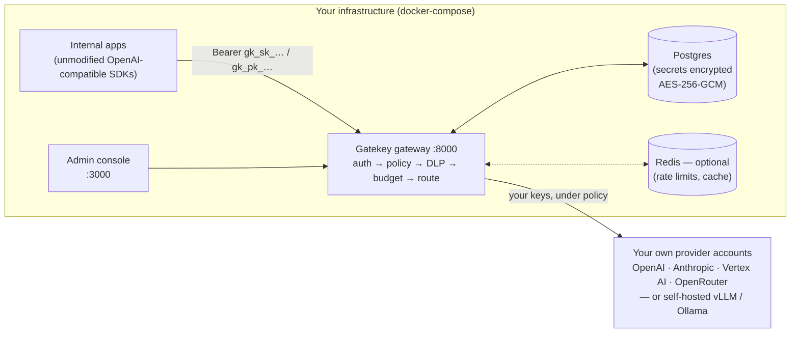

# Gatekey

**A self-hostable enterprise AI gateway.** Bring your own provider API keys
(OpenAI, Anthropic, Google Vertex AI, OpenRouter) or point it at self-hosted
inference (vLLM, Ollama); Gatekey sits in the middle as a unified,
OpenAI-compatible proxy and governance layer — controlling which models
people can use, enforcing budgets, scanning for sensitive data, and giving
you an audit trail over all AI traffic.

Gatekey is **not** a model host and has no cloud service behind it. It never
performs inference itself, nothing phones home, and every component runs in
infrastructure you control. Switching an existing app onto Gatekey means
changing only two things: the base URL and the API key.

## How it fits



The full trust-boundary diagram (what data crosses the deployment boundary,
and what never leaves) is in
[`backend/docs/compliance/data-flow-diagram.md`](backend/docs/compliance/data-flow-diagram.md).

## Quick start

Requirements: Docker with compose. Nothing else — the setup script
generates both secrets itself.

```bash
git clone <this-repo> gatekey && cd gatekey
./setup.sh          # Windows (PowerShell): .\setup.ps1
```

The script generates the two required secrets, writes `.env`, starts
Postgres + backend + console, applies all database migrations
automatically, and waits until everything is healthy. It prints the admin
token you'll sign in with — and a reminder to **back up the master
encryption key** it generated (losing it makes stored provider keys
unrecoverable).

Prefer to do it by hand? `cp .env.example .env`, fill in the two secrets
(generation commands are in the file's comments), and run
`docker compose up --build`.

Then:

1. **Open the console** at `http://localhost:3000` and sign in with the
   admin token. You'll land on the first-run "connect your first provider"
   step — add a real provider API key (it's validated live against the
   provider before being saved).

2. **Create a user, a team, and a service-account key.** Every
   service-account key is attributed to a *(user, team)* pair:

   - **Users** screen — create a user (who spend is attributed to).
   - **Teams** screen — create a team, open it, add the user as a member
     with a budget.
   - **Service Accounts** screen — create the key for that user + team.
     The secret (`gk_sk_...`) is shown exactly once — copy it immediately.

3. **Make your first proxied request:**

   ```bash
   curl http://localhost:8000/v1/chat/completions \
     -H "Authorization: Bearer gk_sk_..." \
     -H "Content-Type: application/json" \
     -d '{"model": "gpt-4o-mini", "messages": [{"role": "user", "content": "hello"}]}'
   ```

   Point any OpenAI-compatible SDK at `http://localhost:8000` with the
   `gk_sk_...` key and it just works — see
   [`backend/examples/`](backend/examples/) for drop-in Python and
   JavaScript before/after examples.

### Optional add-ons

| Add-on | How to enable |
|---|---|
| **Redis** (rate limiting, response caching, shared state) | `./setup.sh --cache` — or manually: `docker compose --profile cache up` **and** `GATEKEY_REDIS_URL=redis://redis:6379/0` in `.env`. Both steps are required; the profile alone does nothing. |
| **SSO** (OIDC, with a bundled dev-only Keycloak for local testing) | `./setup.sh --sso`, then follow [docs/sso.md](docs/sso.md). |
| **Email alerts** (budget thresholds; webhooks work with no server config) | Set the `GATEKEY_SMTP_*` variables — see [docs/configuration.md](docs/configuration.md). |

## What you get

| Area | Capabilities |
|---|---|
| **Unified gateway** | OpenAI-compatible `/v1/chat/completions`, `/v1/completions`, `/v1/embeddings`; streaming (SSE); drop-in for existing SDKs. |
| **Provider & key management** | BYOK for OpenAI/Anthropic/Vertex AI/OpenRouter plus self-hosted endpoints (vLLM/Ollama/any OpenAI-compatible), validated live on entry, encrypted at rest (AES-256-GCM), never displayed again. Register brand-new provider models yourself (with your own pricing) the day they ship — no Gatekey release needed. |
| **Model policy** | Org-wide allow/denylist that teams can only narrow, never widen; per-request enforcement with plain-language "which layer blocked this" errors. |
| **Budgets** | Org / team / member budget hierarchy with atomic spend accounting, hard cutoff, monthly/quarterly periods, and optional automatic model downgrade at spend thresholds (with `X-Gatekey-Degraded` response headers). |
| **Teams & identity** | Four server-enforced roles (Org Admin, Auditor, Team Lead, Member), join-request onboarding, optional OIDC SSO and SCIM 2.0 provisioning, personal API keys, break-glass admin token. |
| **Security & compliance** | DLP/PII scanning (Presidio, in-process — log/redact/block), content-classification-aware routing (PII, source code, financial, legal), data-residency rules, scheduled access windows, automatic key rotation, configurable retention. |
| **Audit** | Append-only trail of every governance mutation, with an optional tamper-evident hash chain whose verify endpoint pinpoints the exact broken entry. |
| **Reliability & cost** | Multi-key failover with active health checks, Redis-backed rate limiting (requests + tokens/min), exact-match response caching, cost/reliability dashboard with CSV/JSON export. |
| **AI oversight** | Provider drift detection (daily canary suite against a rolling baseline), shadow-AI discovery from your SASE/proxy logs (allowlist-only storage, dedicated data-handling policy). |

## Documentation

| Document | What's in it |
|---|---|
| [docs/configuration.md](docs/configuration.md) | Every environment variable, with defaults and gotchas |
| [docs/sso.md](docs/sso.md) | SSO setup — bundled dev Keycloak and production IdPs |
| [docs/console.md](docs/console.md) | Tour of every admin and non-admin console screen |
| [docs/known-limitations.md](docs/known-limitations.md) | Honest list of what's unverified, estimated, or deliberately deferred |
| [docs/development.md](docs/development.md) | Running backend/frontend locally, tests, cli-sync |
| [CONTRIBUTING.md](CONTRIBUTING.md) | Dev setup, test requirements, ground rules for changes |
| [CHANGELOG.md](CHANGELOG.md) | Release history |
| [`backend/docs/compliance/`](backend/docs/compliance/) | Data-flow diagram + data-handling policy, written for customer security reviews |

## Repository layout

```
backend/            FastAPI gateway + admin API (Python)
frontend/           Admin & user console (Next.js/React)
cli-sync/           gatekey-sync CLI - keeps a rotated personal API key
                    synced to local tools via the OS keychain
devops/keycloak/    Dev-only Keycloak realm for SSO testing
docs/               Operator documentation
gatekey/            Product requirement documents (historical scope)
setup.sh, setup.ps1 One-command bootstrap
docker-compose.yml  Local self-hosted deployment
```

## Design principles

- **Self-hosted first** — no phone-home telemetry; SSO, Keycloak, and SMTP
  are strictly opt-in.
- **No plaintext secrets at rest or in logs** — provider keys and webhook
  URLs encrypted, bearer secrets stored as hashes.
- **Server-side enforcement** — the UI hiding a control is never the only
  guard.
- **Disclose, don't oversell** — anything unverified or estimated is
  labeled as such, in [docs/known-limitations.md](docs/known-limitations.md)
  and in the product itself.

## License

[Apache-2.0](LICENSE). Contributions welcome — see
[CONTRIBUTING.md](CONTRIBUTING.md).
