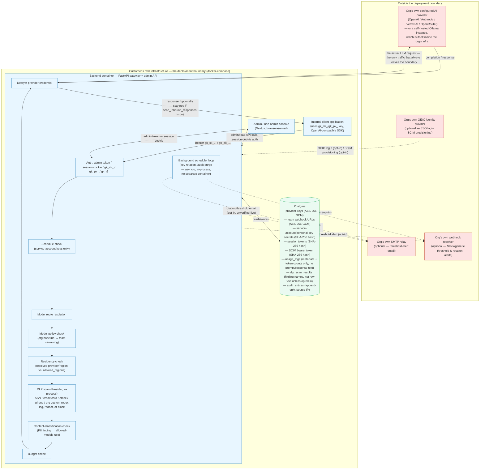

# Gatekey — Data Flow Diagram

This diagram describes what a **self-hosted Gatekey deployment** (the default
`docker-compose.yml` in this repository) actually does with data, for use in
a customer security review or vendor risk assessment.

Gatekey has no Gatekey-operated backend service of any kind. Every box below
runs inside infrastructure the deploying organization owns and controls —
there is no "Gatekey cloud" in this picture.

## Trust boundary overview

## What crosses the deployment boundary

Solid arrows above are boundary-crossing traffic; dashed arrows are
opt-in/conditional traffic that only exists if the deploying org configured
that feature. Nothing else leaves the deployment.

1. **The proxied LLM request itself**, to whichever provider the org
   configured (OpenAI, Anthropic, Vertex AI, OpenRouter) — always present,
   this is the gateway's core function. If the org points Gatekey at a
   self-hosted Ollama instance instead, that traffic stays inside the org's
   own infrastructure and never reaches a third party at all.
2. **Threshold-alert webhook** (`services/notifiers.py`) — only if a team's
   Org Admin configured a webhook URL (encrypted at rest) and enabled it.
   Fires on 80%/100% budget crossings and on rotation events.
3. **Threshold-alert / rotation email via SMTP** — only if the deployer set
   `GATEKEY_SMTP_*` env vars. See the data handling policy for the
   unverified-live caveat on this path.
4. **OIDC discovery/token exchange with the org's own IdP** — only if SSO is
   configured (`GATEKEY_OIDC_*` env vars set). The IdP is chosen and operated
   by the customer, not by Gatekey.
5. **Inbound SCIM calls from the org's own IdP** — only if SCIM is enabled
   (`scim_config.enabled = true`); this is inbound to Gatekey, not outbound.

**Explicitly not present, anywhere in this codebase**: no telemetry,
analytics, crash reporting, update-check, or "phone home" call to Gatekey's
maintainers or any Gatekey-operated service. There is no such service —
self-hosted-first is a repository-wide non-negotiable
(`gatekey/00-overview.md`), and nothing in the reviewed source
(`backend/src/gatekey/`) makes an outbound HTTP call to any destination
other than the four categories above.

## Encryption-at-rest map (all inside the customer's own Postgres)

| Data | Mechanism | Reversible? |
|---|---|---|
| Provider API keys (OpenAI/Anthropic/Vertex/OpenRouter) + prior key during guided rotation overlap | AES-256-GCM (`services/encryption.py`), key from `GATEKEY_MASTER_KEY` | Yes — decrypted on each outbound provider call |
| Team webhook URLs (Slack/generic) | AES-256-GCM, same mechanism | Yes — a webhook URL is bearer-equivalent, so it gets the same treatment as a provider key |
| Service-account key secrets (`gk_sk_...`), personal key secrets (`gk_pk_...`), CLI refresh credentials (`gk_rf_...`) | SHA-256 digest only | No — one-way hash, matches the "shown once, never again" UX; Gatekey never needs to recover the plaintext |
| Session cookie tokens | SHA-256 digest only | No |
| SCIM bearer token | SHA-256 digest only | No |

See the data handling policy for what this means for a compromise scenario
and for TLS/transport-layer scope.

## Sizing note

This diagram reflects a single-backend-container, single-Postgres-instance
deployment (the shipped `docker-compose.yml`). If a deployment runs multiple
backend replicas, the in-process caches (model policy, residency, access
schedule) and the scheduler loop's claim-and-advance mechanism still work
correctly per Phase 3's design doc (`docs/design/
phase-3-security-compliance-design.md` §4.2), but every replica talks to the
same single Postgres instance — there is still exactly one data store to
account for in a review.
